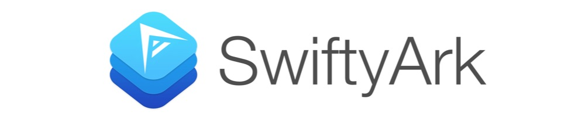

<p align="center">
    
    <a href="https://developer.apple.com/swift"></a>
    <a href="https://cocoapods.org/pods/SwiftyArk"></a>
     <br><br>
</p>

## Overview

SwiftyArk is a simple, lightweight framework for the [Ark Ecosystem](https://ark.io). SwiftyArk provides a simple wrapper for accessing Ark accounts, delegates, block, and transaction information.

SwiftyArk's networking component is fully asynchronous and have extensive error handling. SwiftyArk data structures are type-safe and favor immutability.


## Requirements
* iOS 8.0+
* mac OSX 10.10+
* Swift 3.0

## Documentation

SwiftyArk is 100% documented and available [here]()

### Getting Started:

The Ark APi is accessed with the `ArkManager`:

```swift
let manager = ArkManager()
```

`ArkManager` handles all network calls and returns results asynchronous in a closure:

```swift
manager.delegates { (error, delegates) in
   if let arkError = error {
        print(arkError.localizedDescription)
           return
    }

    if let currentDelegates = delegates {
    	// List of delegates
     }
}
```


With the manager instance, you can access an account:

```swift
manager.account(address: "AUexKjGtgsSpVzPLs6jNMM6vJ6znEVTQWK") { (error, arkAccount) in
  if let account = arkAccount {
       // Account(address: "AUexKjGtgsSpVzPLs6jNMM6vJ6znEVTQWK",
       // unconfirmedBalance: 16118512.398923151,
       // balance: 16118512.398923151,
       // publicKey: "02ff171adaef486b7db9fc160b28433d20cf43163d56fd28fee72145f0d5219a4b",
       // unconfirmedSignature: Optional(0),
       // secondSignature: Optional(0),
       // multisignatures: Optional([]),
       // secondPublicKey: nil,
       // unconfirmedMultisignatures: Optional([]))
   }
}
```

The manager instance can store a session for easy accessing of an address/delegate:

```swift
manager.delegate("jarunik") { (error, delegate) in
   if let arkDelegate = delegate {
		// Delegate(username: "jarunik", 
		// address: "Aasu14aTs9ipZdy1FMv7ay1Vqn3jPskA8t", 
		// publicKey: "02c7455bebeadde04728441e0f57f82f972155c088252bf7c1365eb0dc84fbf5de",
		// votes: 1246983.70585494,
		// producedblocks: 
		// 28670, 
		// missedblocks: 61, 
		// rate: 47, 
		// approval: 0.970000029, 
		// productivity: 99.7900009)
       // Update the session settings with delegate
       manager.updateSettings(delegate: arkDelegate)
   }
}
```

With the stored session credentials, you can easily access acccount information:

```swift
 manager.lastBlock { (error, block) in
    if let lastBlock = block {
    	 // Block(id: "3725283905614253778",
    	 // version: 0,
    	 // timestamp: 2017-09-19 00:48:48 +0000,
    	 // height: 1948928,
    	 // previousBlock: "17490567348134875423",
    	 // numberOfTransactions: 0,
    	 // totalAmount: 0.0,
    	 // totalFee: 0.0,
    	 // reward: 2.0,
    	 // payloadLength: 0,
    	 // payloadHash: "e3b0c44298fc1c149afbf4c8996fb92427ae41e4649b934ca495991b7852b855",
    	 // generatorPublicKey: "#{key}",
    	 // generatorId: "ARAq9nhjCxwpWnGKDgxveAJSijNG8Y6dFQ",
    	 // blockSignature: "#{signature}",
    	 // confirmations: 27,
    	 // totalForged: 2.0)
    }
 }
```
SwiftyArk also has a built in Ark Ticker provided by [CoinMarketCap](https://coinmarketcap.com) with support for [31 currencies]():

```swift
manager.ticker(currency: .cad) { (error, ticker) in
   if let canadianTicker = ticker {
        // Ticker(currency: SwiftyArk.Currency.cad,
        // id: "ark",
        // name: "Ark",
        // symbol: "ARK",
        // rank: 20,
        // price: 4.3638476501000003,
        // bitcoinPrice: 0.00088648999999999998,
        // volume24Hour: 5406421.2865599999,
        // marketCap: 426120847.0,
        // availableSupply: 97647966.0,
        // totalSupply: 128897966.0,
        // percentChange1h: -3.7999999999999998,
        // percentChange24h: 1.8700000000000001,
        // percentChange7d: -1.1100000000000001)
   }
}
```

## Installation

### Cocoapods:

SwiftyArk is available through [CocoaPods](http://cocoapods.org). To install
it, simply add the following line to your Podfile:

```ruby
pod "SwiftyArk"
```

In your project, be sure to import `SwiftyArk` in your project header:

```swift
import SwiftyArk
```

### Manual Installation:

Simply copy the contents of the `Source` folder into your project.

## License

SwiftyArk is available under the MIT license. See the LICENSE file for more info.

## Author

If you have any questions, requests, or enhancements, feel free to submit a pull request, create an issue, or contact me in person:

**Andrew Walz**
**andrewjwalz@gmail.com**

## Support

`SwiftyArk` is 100% open source and made with :heart:. If you would like to contribute:

Ark Address: `AYdHH5TsZF796pv7gxVU1tK6DLkUxMK1VL`

Bitcoin Address: `16HPSJkzaQWWYyATrAnzCiLCQ2GSJETJbL`

## Sponsors

Delegate Sponsor - [Jarunik](https://forum.ark.io/topic/251/jarunik-delegate-proposal-80-voters-20-reserves-10-costs)
